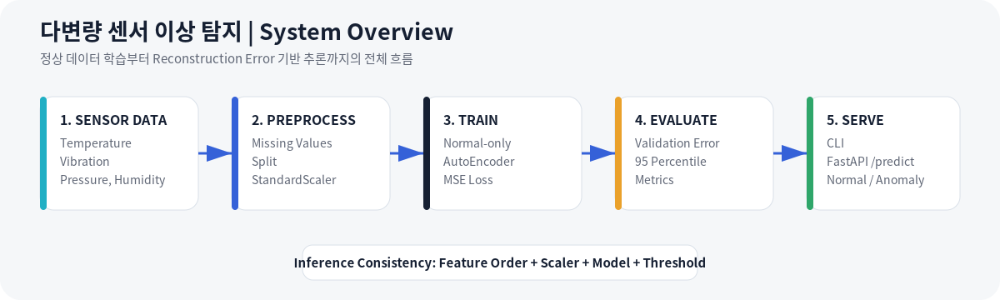
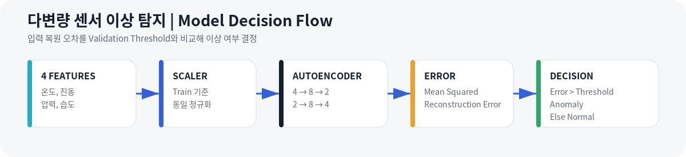

# 다변량 센서 이상 탐지

**Normal-only AutoEncoder Training, Reconstruction Error Evaluation, and FastAPI Inference**

> 온도, 진동, 압력, 습도 센서의 전처리부터 PyTorch AutoEncoder 학습 코드, Reconstruction Error 평가, CLI와 FastAPI 추론까지 연결한 이상 탐지 파이프라인입니다.

<p>
  
  
  
  
</p>

---

## Why This Project

제조 설비의 이상은 온도 한 가지 값만으로 설명되지 않고 진동, 압력, 습도 등 여러 센서의 조합에서 나타날 수 있습니다. 그러나 실제 이상 사례는 정상 데이터보다 적고, 발생 가능한 이상 유형을 모두 미리 수집하기도 어렵습니다.

그래서 이 프로젝트는 특정 이상 Class를 직접 학습하는 대신 정상 상태의 센서 패턴을 먼저 학습하고, 입력을 복원했을 때 발생하는 오차를 이상 점수로 사용하는 방식을 적용했습니다.

다음 질문에 답하는 것이 목표입니다.

1. 서로 Scale이 다른 센서값을 일관된 기준으로 처리할 수 있는가?
2. 이상 Label을 학습에 직접 사용하지 않고 정상 패턴을 학습할 수 있는가?
3. Test에 맞추지 않고 Validation Error 분포에서 Threshold를 정할 수 있는가?
4. 학습에 사용한 Scaler, Model과 판별 기준을 추론에서도 동일하게 적용할 수 있는가?
5. 단일 센서 입력을 CLI와 API에서 같은 방식으로 판단할 수 있는가?

---

## Project Overview

| 항목 | 내용 |
|---|---|
| **기간** | 2026.05 |
| **형태** | 개인 프로젝트 |
| **목표** | 정상 데이터 기반 AutoEncoder 학습·평가·추론이 가능한 이상 탐지 파이프라인 구성 |
| **입력** | Temperature, Vibration, Pressure, Humidity |
| **범위** | 샘플 데이터 생성, 결측치 처리, Split, Scaling, 정상 데이터 학습, Threshold 설정, 평가, CLI, FastAPI, 문서화 |
| **모델** | PyTorch AutoEncoder, `4 → 8 → 2 → 8 → 4` |
| **판별** | Validation 정상 Error의 95 Percentile Threshold |
| **기술** | Python, pandas, NumPy, scikit-learn, PyTorch, FastAPI, Pydantic |
| **구현 결과** | 데이터 생성, 전처리, 학습 Loop, 평가, CLI와 `/predict` API 코드를 하나의 실행 흐름으로 연결 |

### Public Evidence Boundary

공개 저장소에서 확인할 수 있는 것은 다음 범위입니다.

- AutoEncoder Architecture
- 정상 Sample 기반 Training Loop
- MSE Loss와 Adam Optimizer
- Validation Loss 계산
- Checkpoint와 학습 이력 저장 코드
- Reconstruction Error 평가 코드
- CLI와 FastAPI 추론 코드

다음 Artifact는 공개 저장소에 Commit되어 있지 않습니다.

- 실제 학습된 Model Checkpoint
- 실행으로 생성된 Dataset
- Train History 결과 파일
- 전체 Test Evaluation 결과 파일

따라서 이 README에서는 **“모델을 학습해 성능을 달성했다”가 아니라 “학습·평가·추론 파이프라인을 구성했다”**고 표현합니다.

---

## Why This Model

현재 입력은 한 시점의 온도, 진동, 압력, 습도 4개 값으로 구성된 **행 단위 다변량 데이터**입니다. 시간 순서가 포함된 Sequence Window가 아니므로, 먼저 작은 AutoEncoder를 사용하는 정상 데이터 기반 학습 파이프라인을 구성했습니다.

| 설계 선택 | 이유 |
|---|---|
| **AutoEncoder** | 정상 Sample의 복원 오차를 기준으로 이상 여부를 판단하는 학습 구조를 구현하기 적합 |
| **4 → 8 → 2 → 8 → 4** | 입력 4개를 2차원 Bottleneck으로 압축해 정상 Feature 관계를 학습하면서도, 작은 샘플 프로젝트에서 과도한 Parameter 증가를 피함 |
| **ReLU** | 단순한 비선형 관계를 학습하기 위한 기본 Activation |
| **MSE Loss** | 입력과 복원값의 Feature별 차이를 하나의 Reconstruction Error로 계산하기 쉬움 |
| **StandardScaler** | 센서별 단위와 범위가 달라 특정 Feature가 MSE를 지배하는 문제를 줄임 |
| **Normal-only Training** | 정상 Sample만 학습에 사용하는 DataLoader와 Training Loop를 구성 |
| **Validation 95 Percentile** | Test 결과를 보고 기준을 정하지 않고, 정상 Validation Error 분포에서 Threshold를 결정 |

### Architecture Interpretation

```text
4 Input Features
→ 8 Hidden Units
→ 2-Dimensional Bottleneck
→ 8 Hidden Units
→ 4 Reconstructed Features
```

- Encoder는 4개 센서 입력을 2차원 Bottleneck으로 압축하도록 설계했습니다.
- Decoder는 Bottleneck에서 원래 4개 센서값을 복원하도록 설계했습니다.
- Training Loop는 입력과 복원 결과의 MSE를 줄이도록 구성했습니다.
- 추론에서는 Reconstruction Error와 Threshold를 비교하도록 구현했습니다.

> `4 → 8 → 2 → 8 → 4`가 산업 현장의 최적 구조라는 의미는 아닙니다. 현재 프로젝트의 4개 Feature와 작은 학습 범위에서 학습·평가·추론 Pipeline을 검증하기 위한 경량 Baseline입니다.

---

## Training Pipeline Design

```text
Generate Sample Data
→ Handle Missing Values
→ Train / Validation / Test Split
→ Fit StandardScaler on Train
→ Select Normal Train Samples
→ Train AutoEncoder
→ Calculate Normal Validation Errors
→ Set 95 Percentile Threshold
→ Evaluate on Test
```

### Implemented Training Configuration

| 항목 | 설정 | 목적 |
|---|---:|---|
| Random Seed | 42 | 데이터 Split과 학습 실행의 재현성 확보 |
| Epochs | 80 | 작은 모델이 정상 패턴을 학습할 수 있도록 반복 |
| Batch Size | 32 | 작은 Dataset에서 안정적인 Mini-batch 학습 |
| Optimizer | Adam | 별도 복잡한 튜닝 없이 사용할 수 있는 기본 Optimizer |
| Learning Rate | 0.001 | AutoEncoder Baseline 학습의 초기값 |
| Loss | MSE | 입력과 복원 결과의 차이 최소화 |
| Training Samples | Normal only | 정상 패턴 학습 |
| Validation | Normal Validation | Threshold 결정과 과적합 확인 |
| Test | Normal + Anomaly | 최종 Precision, Recall, F1과 Confusion Matrix 평가 |

### What the Training Code Optimizes

학습 코드는 `normal` 또는 `anomaly` Class를 직접 분류하지 않습니다.  
정상 데이터의 4개 센서 입력을 복원하도록 MSE를 최소화하고, Class 판정은 저장된 Model과 Threshold를 사용해 다음 정책으로 수행하도록 구성했습니다.

```text
reconstruction_error > threshold  → anomaly
reconstruction_error <= threshold → normal
```

---

## Why Not Transformer

현재 버전에는 Transformer를 사용하지 않았습니다.

| 현재 데이터와 목표 | Transformer를 사용하지 않은 이유 |
|---|---|
| 한 행에 4개 센서값 | Token 또는 Time Step 사이의 Attention을 학습할 Sequence가 없음 |
| 시간 Window 미구성 | 과거 여러 시점의 변화와 장기 의존성을 입력하지 않음 |
| 작은 생성 Dataset | Transformer Parameter를 안정적으로 비교할 근거가 부족함 |
| Baseline Pipeline 검증 | 먼저 전처리, 정상 학습, Threshold, 평가, API 흐름을 명확히 검증하는 것이 우선 |

Transformer를 적용하려면 먼저 입력을 다음처럼 바꿔야 합니다.

```text
Current:
[temperature, vibration, pressure, humidity]

Future Sequence Window:
[
  [t1_temperature, t1_vibration, t1_pressure, t1_humidity],
  [t2_temperature, t2_vibration, t2_pressure, t2_humidity],
  ...
  [tN_temperature, tN_vibration, tN_pressure, tN_humidity]
]
```

그다음 다음 모델을 동일한 Split과 평가 기준으로 비교할 수 있습니다.

1. 현재 Dense AutoEncoder
2. LSTM AutoEncoder
3. 1D CNN AutoEncoder
4. Transformer Encoder 또는 Transformer AutoEncoder

비교 기준은 Precision, Recall, F1, PR-AUC, 추론 지연 시간, Parameter 수와 False Negative입니다.

---

## Problem → Implementation → Result

| Problem | Implementation | Result |
|---|---|---|
| 센서마다 값의 범위가 달라 특정 Feature가 Loss를 지배할 수 있음 | Train Data 기준 `StandardScaler` 적용 | 학습과 추론에서 동일한 Scale 기준 유지 |
| 이상 유형을 모두 수집해 지도학습하기 어려움 | 정상 Sample만 사용해 AutoEncoder 학습 | 정상 패턴과 다른 입력을 Reconstruction Error로 비교 |
| Test 결과를 보고 Threshold를 정하면 평가가 왜곡될 수 있음 | Validation 정상 Error의 95 Percentile 사용 | Threshold 결정과 Test 평가 역할 분리 |
| Accuracy만으로는 이상 누락을 확인하기 어려움 | Precision, Recall, F1, Confusion Matrix 병행 | 이상 누락과 정상 오탐을 별도 확인 |
| 모델만 저장하면 실제 입력을 재현하기 어려움 | Feature 순서, Scaler, Model, Threshold를 추론 흐름에 연결 | CLI와 FastAPI에서 동일한 판별 구조 사용 |
| 공개 저장소에 생성 Artifact를 모두 올리면 재현 과정이 보이지 않음 | 코드로 데이터와 Artifact를 다시 생성하도록 구성 | 실행 순서로 `data/`, `models/`, `outputs/` 생성 |

---

## System Overview



| 단계 | 내용 |
|---|---|
| **Sensor Data** | 온도, 진동, 압력, 습도와 Label을 포함한 샘플 데이터 생성 |
| **Preprocess** | 결측치 처리, Feature와 Label 분리, Train·Validation·Test Split, Scaling |
| **Train** | 정상 Train Sample만 사용하는 AutoEncoder Training Loop |
| **Evaluate** | Validation Error 기반 Threshold와 Test 지표 계산 코드 |
| **Serve** | 저장된 Scaler와 Model을 이용해 CLI와 FastAPI 추론 |

---

## Practical Evaluation Criteria

이상 탐지의 합격 기준은 이상 누락 비용과 정상 오탐 비용에 따라 달라집니다. 따라서 하나의 Accuracy보다 다음 기준을 함께 확인해야 합니다.

| 실무 관점 | 평가 기준 | 프로젝트에서 충족한 범위 |
|---|---|---|
| **이상 누락 확인** | Anomaly Recall, False Negative | Recall과 Confusion Matrix를 평가 코드에 포함 |
| **정상 오탐 관리** | Precision, False Positive | Precision과 정상 오탐 사례를 함께 해석 |
| **Threshold 독립성** | Test가 아닌 Validation으로 기준 설정 | 정상 Validation Error의 95 Percentile 사용 |
| **전처리 일관성** | 학습과 추론의 Feature 순서와 Scale 동일 | 저장된 StandardScaler를 CLI와 API에서 재사용 |
| **평가 범위** | Accuracy, Precision, Recall, F1, Confusion Matrix | `src/evaluate.py`에서 다중 지표 산출 |
| **추론 재현성** | Model, Scaler, Threshold와 Input Schema 연결 | CLI와 FastAPI `/predict` 구현 |
| **운영 한계 인식** | Drift, 실제 설비 데이터, Sequence Window 구분 | 현재 범위와 다음 개선 과제를 문서화 |

> 현재 프로젝트는 **정상 데이터 기반 학습 Loop, Validation Threshold 산출, 다중 지표 평가, CLI와 API 추론 구조를 코드로 구성한 범위**를 충족했습니다. 공개 저장소에는 재현 가능한 학습 결과 Artifact가 포함되어 있지 않으므로 모델 성능 달성을 주장하지 않습니다.

---

## Model Decision Flow



```text
reconstruction_error > threshold  → anomaly
reconstruction_error <= threshold → normal
```

### Model Architecture

```text
Input 4
→ Linear 4→8
→ ReLU
→ Linear 8→2
→ ReLU
→ Linear 2→8
→ ReLU
→ Linear 8→4
→ Reconstructed Input
```

> 학습 설정과 선택 이유는 위의 `Training Strategy`에서 설명합니다.

---

## Technical Details

<details open>
<summary><b>01 | Data Generation and Preprocessing</b></summary>

<br>

### Features

| Feature | Meaning |
|---|---|
| `temperature` | 설비 온도 상태 |
| `vibration` | 진동 상태 |
| `pressure` | 압력 상태 |
| `humidity` | 습도 상태 |

### Pipeline

```text
CSV Load
→ Missing Value Handling
→ Feature / Label Split
→ Train / Validation / Test Split
→ Train Scaler Fit
→ Validation / Test Transform
→ Normal-only Train Selection
```

Scaler를 전체 데이터나 Test에 Fit하지 않고 Train 기준으로 학습해 데이터 역할을 구분했습니다.

</details>

<details>
<summary><b>02 | Training Loop</b></summary>

<br>

`src/train.py`는 **정상 Train Sample**로 Weight를 업데이트하고 Validation Loss를 계산할 수 있는 Training Loop를 구현합니다.

- Random Seed 42
- `TensorDataset`과 `DataLoader`
- Normal-only Train Batch
- AutoEncoder Forward
- MSE Loss
- Adam Update
- Validation Loss
- Model Checkpoint 저장
- Epoch별 Train과 Validation Loss CSV 저장

코드상 Validation은 Weight Update에 사용하지 않으며, 학습 진행 확인과 Threshold 산출을 위한 별도 기준으로 구성되어 있습니다.

학습 코드의 기본 출력:

```text
models/autoencoder.pt
outputs/train_history.csv
```

</details>

<details>
<summary><b>03 | Threshold and Evaluation</b></summary>

<br>

Threshold는 정상 Validation Sample의 Reconstruction Error 분포에서 95 Percentile로 정합니다.

평가 지표:

- Accuracy
- Precision
- Recall
- F1 Score
- Confusion Matrix

현재 README에는 샘플 실행 결과가 기록돼 있지만, 공개 저장소에 Model Checkpoint와 전체 평가 Artifact가 Commit되어 있지 않습니다. 따라서 특정 Recall, Precision, F1을 대표 성과로 사용하지 않고, 학습·평가 코드와 실행 파이프라인 구현 범위만 설명합니다.

</details>

<details>
<summary><b>04 | CLI and FastAPI</b></summary>

<br>

### CLI

```powershell
python .\src\predict.py `
  --temperature 25 `
  --vibration 0.3 `
  --pressure 101 `
  --humidity 45
```

### API

| Method | Endpoint | Role |
|---|---|---|
| GET | `/` | Service와 Endpoint 정보 |
| POST | `/predict` | 센서 입력의 Reconstruction Error와 이상 여부 반환 |

API 입력은 Pydantic `SensorInput`으로 검증합니다.

</details>

<details>
<summary><b>05 | Current Scope and Next Steps</b></summary>

<br>

### Current Scope

- 생성한 샘플 센서 데이터 기반
- 행 단위 4개 Feature 입력
- 정상 데이터 기반 AutoEncoder
- Validation Percentile Threshold
- CLI와 FastAPI 추론
- Sequence Window를 사용하는 시계열 모델은 아님
- 공개 Repository에는 Source와 문서를 Commit하고, 생성 데이터와 Model Artifact는 제외

### Next Steps

1. 실제 설비 센서 Dataset 적용
2. 시간 Window와 변화율 Feature 구성
3. LSTM AutoEncoder, 1D CNN, Isolation Forest 비교
4. Precision-Recall Curve 기반 운영 Threshold 검토
5. Feature별 Reconstruction Error 기여도 분석
6. Model Version, Request Log와 Monitoring
7. Data Drift 감지와 Threshold 재보정
8. 자동화된 회귀 테스트와 CI 추가

</details>

---

## API Response

Request:

```json
{
  "temperature": 25,
  "vibration": 0.3,
  "pressure": 101,
  "humidity": 45
}
```

Response structure:

```json
{
  "prediction": "normal",
  "reconstruction_error": 0.412345,
  "threshold": 1.569105,
  "input": {
    "temperature": 25,
    "vibration": 0.3,
    "pressure": 101,
    "humidity": 45
  }
}
```

> `reconstruction_error`는 입력과 학습 Artifact에 따라 달라집니다.

---

## Run and Verify

### Setup

```powershell
python -m venv .venv
.\.venv\Scripts\Activate.ps1
python -m pip install --upgrade pip
python -m pip install -r .\requirements.txt
```

### Reproduce the Pipeline

다음 명령을 순서대로 실행해야 Dataset, Model Checkpoint와 평가 Artifact가 로컬에 생성됩니다.

```powershell
python .\src\generate_data.py
python .\src\preprocess.py
python .\src\train.py
python .\src\evaluate.py
```

### CLI

```powershell
python .\src\predict.py `
  --temperature 80 `
  --vibration 5.0 `
  --pressure 180 `
  --humidity 90
```

### FastAPI

```powershell
python -m uvicorn src.app:app --reload
```

Swagger UI:

```text
http://127.0.0.1:8000/docs
```

---

## Project Structure

```text
sensor-anomaly-model-pipeline/
├── docs/
│   └── assets/
├── src/
│   ├── app.py
│   ├── evaluate.py
│   ├── generate_data.py
│   ├── model.py
│   ├── predict.py
│   ├── preprocess.py
│   └── train.py
├── .gitignore
├── README.md
└── requirements.txt
```

실행 과정에서 다음 경로가 로컬에 생성됩니다.

```text
data/       # 생성된 CSV
models/     # AutoEncoder와 Scaler
outputs/    # 전처리 데이터, 학습 기록, 평가 결과
```

생성 Artifact는 `.gitignore` 대상이며, 공개 저장소에는 재생성 가능한 Source Code를 중심으로 구성했습니다.

---

## What This Project Demonstrates

- 온도, 진동, 압력, 습도 다변량 센서 전처리 경험
- 정상 데이터만 사용하는 PyTorch AutoEncoder Training Loop 구성 경험
- Reconstruction Error와 Validation Threshold 산출 파이프라인 구성 경험
- Accuracy 단독 평가 대신 Precision, Recall, F1과 Confusion Matrix를 확인한 경험
- Train 기준 Scaler를 평가와 추론에 재사용한 경험
- Model, Scaler, Threshold를 CLI와 FastAPI 입력 흐름에 연결하도록 구현한 경험
- 구현된 범위와 시계열 모델이 아닌 점을 구분해 설명한 경험

---

## Contact

- Developer: 김수진
- GitHub: [github.com/lightleaping](https://github.com/lightleaping)
- Email: workingskyroad@gmail.com
