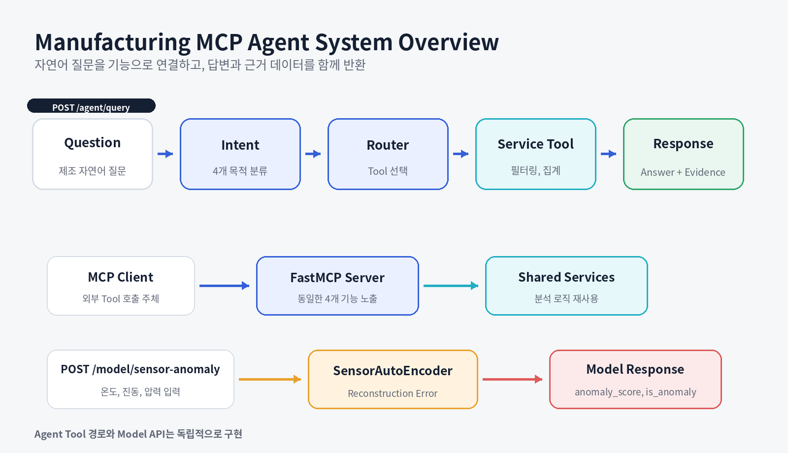
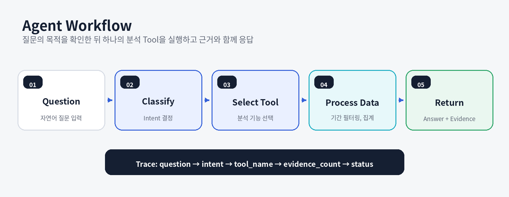

# 제조 품질 분석 NLP Agent

> **Manufacturing MCP Agent**  
> 제조 자연어 질문을 Intent로 분류하고, 필요한 분석 Tool을 실행해 **Answer와 Evidence**를 함께 반환하는 제조 데이터 분석 Agent 프로젝트입니다.

<p>
  
  
  
  
  
</p>

---

## Why This Project

제조 현장의 질문은 자연어로 입력되지만, 답을 만들기 위해 필요한 데이터와 계산 방식은 질문마다 다릅니다.

- 불량률 질문은 생산량과 불량 수량 집계가 필요합니다.
- 센서 이상 질문은 온도, 진동, 압력 기준 확인이 필요합니다.
- 라인 상태 질문은 생산성과 품질 정보를 함께 요약해야 합니다.
- 원인 후보 질문은 불량률과 센서 이상 정보를 조합해야 합니다.

모든 질문을 하나의 함수나 고정 답변으로 처리하면 분석 기능이 복잡하게 얽히고, 답변의 근거도 확인하기 어렵습니다. 그래서 **질문 해석, Tool 선택, 데이터 분석, 응답 생성**을 분리하고, 계산 결과와 근거 데이터를 함께 반환하는 구조를 구현했습니다.

---

## Project Overview

| 항목 | 내용 |
|---|---|
| **기간** | 2026.04–05 |
| **형태** | 개인 프로젝트 |
| **목표** | 제조 자연어 질문을 분석 기능으로 연결하고, 답변과 근거 데이터를 함께 반환 |
| **프로젝트 범위** | 샘플 제조 데이터, Intent, Router, LangGraph, 분석 Tool, FastMCP Server, FastAPI, PyTorch Model Endpoint, Docker, GitHub Actions, pytest |
| **NLP 범위** | 질문의 목적을 규칙 기반 Intent로 분류하고 처리 경로를 결정 |
| **기술** | Python, FastAPI, Pydantic, LangGraph, FastMCP, pandas, SQLite, PyTorch, Docker, GitHub Actions |
| **구현 결과** | 4 Intents, 4 Agent Tools, 4 MCP Tools, 2 POST Endpoints, 핵심 테스트 9개 |

---

## Problem → Implementation → Result

| Problem | Implementation | Result |
|---|---|---|
| 질문마다 필요한 계산 방식이 다름 | Intent와 Router를 두고 기능별 Tool 분리 | 4개 질문 유형을 4개 분석 기능으로 연결 |
| 답변 문장만으로 결과 검증이 어려움 | Summary와 Evidence Row를 함께 반환 | API 응답에서 답변과 근거 데이터를 동시에 확인 |
| 목적 표현과 제조 키워드가 섞일 수 있음 | 목적 표현을 우선 확인하는 Routing 규칙 적용 | 복합 질문의 우선순위를 명시 |
| Agent와 Model 기능의 책임이 혼동될 수 있음 | `/agent/query`와 `/model/sensor-anomaly` 분리 | 규칙 기반 분석과 PyTorch 추론 역할 구분 |
| 로컬 환경에만 의존할 수 있음 | Docker, Docker Compose, GitHub Actions 구성 | 설치, 테스트, 컨테이너 실행 경로 제공 |

---

## System Overview



### Responsibility Separation

| Layer | Responsibility |
|---|---|
| **Intent** | 질문의 목적을 4개 Intent 중 하나로 분류 |
| **Router** | Intent에 대응하는 Tool Name 결정 |
| **Service Tool** | CSV 데이터 로딩, 기간 필터링, 그룹 집계 실행 |
| **Answer Builder** | Tool Summary를 사용자 Answer로 변환 |
| **Evidence** | 계산에 사용된 행과 집계 결과를 구조화 |
| **FastMCP Server** | 동일한 4개 분석 기능을 MCP Tool로 노출 |
| **Model API** | 3개 센서값을 AutoEncoder에 입력해 이상 점수 반환 |

> `/agent/query`는 Python 내부에서 Service Tool을 직접 호출합니다. FastMCP Server는 동일한 Service 기능을 별도 Tool Interface로 노출하며, Agent API가 MCP Client를 통해 호출되는 구조로 과장하지 않습니다.

---

## Practical Evaluation Criteria

Agent 프로젝트는 하나의 정확도 수치만으로 평가하기 어렵습니다. 질문이 올바른 기능으로 연결되는지, Tool 결과를 검증할 수 있는지, Interface와 실행 환경이 일관적인지를 함께 확인해야 합니다.

| 실무 관점 | 평가 기준 | 프로젝트에서 확인한 근거 |
|---|---|---|
| **Routing 정확성** | 대표 질문이 올바른 Intent와 Tool로 연결되는가 | 4개 Intent와 Tool Mapping, Agent Flow Test |
| **Tool 계약 명확성** | Tool의 목적과 입력값이 구분되는가 | FastMCP `@mcp.tool()` 기반 4개 Tool |
| **응답 검증 가능성** | Answer가 근거 데이터와 연결되는가 | `question`, `intent`, `tool_name`, `answer`, `evidence` 구조 |
| **입력 검증** | 잘못된 요청이 실행 전에 차단되는가 | FastAPI와 Pydantic Schema |
| **책임 분리** | Agent 분석과 Model 추론이 섞이지 않는가 | Agent Endpoint와 Model Endpoint 분리 |
| **재현성** | 다른 환경에서도 설치와 검증이 가능한가 | pytest, Docker, GitHub Actions |
| **범위 설명** | 규칙 기반 분석과 모델 결과의 한계를 구분하는가 | 규칙 기반 Intent, 휴리스틱 후보, 독립 Model API 명시 |

현재 구현 범위는 Intent와 Tool 책임 분리, Evidence 기반 응답, MCP Tool 노출, API 검증, Container와 CI 구성입니다. 실제 운영 단계에서는 더 큰 Intent 평가 Dataset, 권한 제어, Tool Audit, Timeout, Monitoring이 추가로 필요합니다.

---

## Intent and Tool Mapping

| Intent | Agent / MCP Tool | Question Example | Result |
|---|---|---|---|
| `defect_rate` | `get_defect_rate_by_line` | 최근 7일 불량률이 가장 높은 라인은? | 라인별 생산량, 불량량, 불량률 |
| `sensor_anomaly` | `detect_machine_anomalies` | 진동이 비정상적인 설비를 찾아줘 | 임계값 초과 센서 기록 |
| `line_performance` | `summarize_line_performance` | LINE_A의 생산성과 품질 상태는? | 생산량, 불량률, 평균 센서값 |
| `quality_issue_candidates` | `infer_quality_issue_candidates_tool` | 불량 원인 후보를 알려줘 | 불량률과 센서 이상 기반 점검 후보 |

### Routing Priority

```text
목적 표현 확인
→ 세부 제조 키워드 확인
→ Intent 결정
→ Tool 선택
→ Summary와 Evidence 반환
```

“불량 원인”처럼 여러 의미가 섞인 질문은 키워드 개수보다 질문의 목적 표현을 우선해 Routing합니다.

---

## Agent Workflow



| 단계 | 처리 |
|---|---|
| **Question** | 자연어 제조 질문 입력 |
| **Classify** | 목적 표현과 제조 키워드로 Intent 결정 |
| **Select Tool** | Intent에 대응하는 하나의 Tool 선택 |
| **Process Data** | CSV 또는 SQLite에서 기간 필터링과 집계 수행 |
| **Return** | Summary는 Answer, 집계 Row는 Evidence로 반환 |

---

## Technical Details

### 01 | Agent State and LangGraph

Agent State에는 다음 정보가 단계별로 추가됩니다.

```text
question
→ intent
→ tool_name
→ tool_result
→ answer
→ evidence
```

LangGraph Workflow:

```text
route_question
→ call_tool
→ build_answer
```

현재 Intent는 규칙 기반입니다. 대규모 언어 모델을 학습하거나 LLM이 최종 답변을 생성하는 프로젝트로 표현하지 않습니다.

### 02 | Data Layer

| Data | Purpose |
|---|---|
| `production_logs` | 라인별 생산량과 작업 정보 |
| `quality_inspection` | 검사 수량, 불량 수량, 불량 유형 |
| `machine_sensor_logs` | 온도, 진동, 압력 센서 기록 |

주요 처리:

```text
CSV Loading
→ Date Range Filtering
→ Line Grouping
→ Sum and Mean Aggregation
→ Defect Rate Calculation
→ Threshold-based Sensor Check
→ Evidence Row Construction
```

현재 핵심 Agent 분석 흐름은 CSV 기반이며, SQLite Schema와 Loader는 확장 기반으로 준비되어 있습니다.

### 03 | FastMCP Server

`app/mcp_server/server.py`에서 FastMCP Server를 생성하고 4개 Tool을 등록합니다.

```python
mcp = FastMCP("manufacturing-mcp-agent")

@mcp.tool()
def defect_rate_by_line(days: int = 7) -> dict:
    ...
```

MCP Tool은 분석 로직을 중복 구현하지 않고 `app/services/`의 기존 Service 함수를 호출합니다.

### 04 | Sensor Model Endpoint

입력:

```text
temperature
vibration
pressure
```

처리:

```text
3 Sensor Values
→ Tensor
→ SensorAutoEncoder
→ Reconstruction Error
→ Threshold
→ anomaly_score and is_anomaly
```

이 기능은 Agent의 규칙 기반 `sensor_anomaly` Tool과 별도의 Model Serving Endpoint입니다. 현재 공개 구현은 학습된 운영 Weight를 검증한 모델이 아니라, PyTorch 추론 Endpoint 구조를 보여주기 위한 기본 구현입니다.

### 05 | Trace and Validation

Trace Log에는 다음 정보가 JSONL 형식으로 누적됩니다.

```text
question
intent
tool_name
evidence_count
status
```

핵심 테스트 범위:

- Intent와 Agent Flow
- Tool별 데이터 집계
- Answer와 Evidence 구조
- SensorAutoEncoder Service
- FastAPI Request와 Response
- Docker와 GitHub Actions 실행 경로

---

## API

### POST `/agent/query`

Request:

```json
{
  "question": "최근 7일간 불량률이 가장 높은 라인을 찾아줘."
}
```

Response:

```json
{
  "question": "최근 7일간 불량률이 가장 높은 라인을 찾아줘.",
  "intent": "defect_rate",
  "tool_name": "get_defect_rate_by_line",
  "answer": "최근 7일 기준 불량률이 가장 높은 라인은 LINE_C입니다.",
  "evidence": [
    {
      "line_id": "LINE_C",
      "output_qty": 1234,
      "defect_qty": 54,
      "avg_defect_rate": 0.0439
    }
  ]
}
```

### POST `/model/sensor-anomaly`

Request:

```json
{
  "temperature": 95.7,
  "vibration": 5.6,
  "pressure": 2.4
}
```

Response:

```json
{
  "temperature": 95.7,
  "vibration": 5.6,
  "pressure": 2.4,
  "anomaly_score": 1023.5,
  "threshold": 1000.0,
  "is_anomaly": true,
  "model": "SensorAutoEncoder"
}
```

---

## Run and Verify

### Local

```powershell
python -m venv .venv
.\.venv\Scripts\Activate.ps1
python -m pip install -r .\requirements.txt
python .\scripts_generate_sample_data.py
uvicorn app.main:app --reload
```

Swagger UI:

```text
http://127.0.0.1:8000/docs
```

### MCP Server

```powershell
python -m app.mcp_server.server
```

### Tests

```powershell
python -m pytest .\tests -q
```

### Docker

```powershell
docker compose up --build
```

---

## Project Structure

```text
manufacturing-mcp-agent/
├── .github/
│   └── workflows/
│       └── ci.yml
├── app/
│   ├── agent/
│   │   ├── graph.py
│   │   ├── prompts.py
│   │   └── state.py
│   ├── db/
│   ├── mcp_server/
│   │   ├── server.py
│   │   └── tools.py
│   ├── models/
│   ├── services/
│   ├── config.py
│   └── main.py
├── data/
├── docs/
│   └── assets/
├── tests/
├── Dockerfile
├── docker-compose.yml
├── pytest.ini
├── README.md
└── requirements.txt
```

---

## Current Scope and Next Steps

### Current Scope

- 공개용 제조 샘플 데이터 기반
- 규칙 기반 Intent Classification
- pandas 집계와 임계값 기반 Tool
- FastMCP Server 4 Tools
- Agent API와 Model API 분리
- Docker와 GitHub Actions 구성
- 인증, 권한, 운영 Monitoring은 범위 밖

### Next Steps

1. Intent별 정답 질문 Dataset과 Confusion Matrix 추가
2. 규칙 기반 Intent와 LLM Structured Intent 비교
3. Tool Argument와 Output Schema 검증 강화
4. Tool 호출 Timeout, Audit Log, 권한 제어
5. Agent Tool과 Model Endpoint의 명시적 연결 정책
6. 실제 제조 데이터 기반 Threshold와 Drift 기준 설계

---

## What This Project Demonstrates

- 자연어 제조 질문을 기능별 Intent로 분류한 경험
- Intent, Router, Tool, Answer Builder의 책임을 분리한 경험
- 답변과 근거 데이터를 구분한 API Response 설계 경험
- pandas 기반 제조 데이터 필터링과 집계 경험
- 동일 Service 기능을 FastAPI와 MCP Tool Interface로 노출한 경험
- Agent API와 PyTorch Model Endpoint의 차이를 구분한 경험
- Docker와 GitHub Actions로 실행 및 테스트 경로를 구성한 경험

---

## Contact

- Developer: 김수진
- GitHub: https://github.com/lightleaping
- Email: workingskyroad@gmail.com
