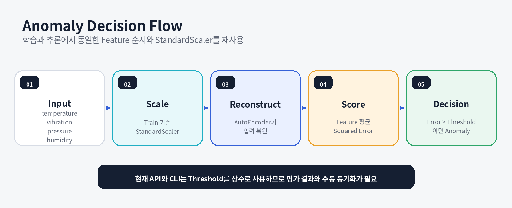

# 다변량 센서 이상 탐지

> **Sensor Anomaly Model Pipeline**  
> 온도, 진동, 압력, 습도 센서 데이터를 전처리하고, 정상 데이터 기반 PyTorch AutoEncoder를 학습해 Reconstruction Error로 이상 여부를 판단하는 모델 파이프라인입니다.

<p>
  
  
  
  
</p>

---

## Why This Project

제조 설비는 온도, 진동, 압력, 습도처럼 서로 단위와 범위가 다른 여러 센서값을 함께 생성합니다. 실제 환경에서는 모든 고장 유형의 이상 데이터를 충분히 확보하기 어렵고, 학습 시점에 없던 새로운 이상 패턴도 발생할 수 있습니다.

이 프로젝트는 이상 유형을 직접 분류하는 대신 **정상 상태의 센서 패턴을 먼저 학습**하고, 정상 패턴을 잘 복원하지 못하는 입력을 이상 후보로 판단하는 방식을 적용했습니다.

핵심 목표는 모델 작성에 그치지 않고 다음 흐름을 연결하는 것입니다.

```text
센서 데이터 생성
→ 전처리와 Split
→ 정상 데이터 학습
→ Reconstruction Error 계산
→ Validation Threshold 결정
→ Test 평가
→ CLI와 FastAPI 추론
```

---

## Project Overview

| 항목 | 내용 |
|---|---|
| **기간** | 2026.05 |
| **형태** | 개인 프로젝트 |
| **목표** | 다변량 센서 입력을 하나의 Reconstruction Error로 변환해 정상과 이상을 구분 |
| **프로젝트 범위** | 샘플 데이터 생성, 결측치 처리, 데이터 분할, 정규화, AutoEncoder 학습, Threshold 설정, 평가, CLI 추론, FastAPI |
| **입력 Feature** | `temperature`, `vibration`, `pressure`, `humidity` |
| **모델** | PyTorch AutoEncoder, `4 → 8 → 2 → 8 → 4` |
| **판단 기준** | Validation 정상 데이터 Reconstruction Error의 95 Percentile |
| **기술** | Python, pandas, NumPy, scikit-learn, PyTorch, Matplotlib, FastAPI, Uvicorn |
| **중요 범위** | 여러 시점의 Sequence를 학습하는 시계열 모델이 아니라, 한 행의 4개 센서값을 함께 처리하는 다변량 이상 탐지 |

---

## Problem → Implementation → Result

| Problem | Implementation | Result |
|---|---|---|
| 이상 유형을 모두 수집하기 어려움 | 정상 Train 데이터만 사용해 AutoEncoder 학습 | 정상 패턴과 다른 입력을 Reconstruction Error로 비교 |
| 센서마다 단위와 값의 범위가 다름 | Train 기준 `StandardScaler` 학습 후 Validation, Test, Inference에 재사용 | 특정 Feature가 Loss를 과도하게 지배하는 문제 완화 |
| Test 결과에 맞춰 Threshold를 정하면 평가가 왜곡될 수 있음 | Validation 정상 Error의 95 Percentile을 Threshold로 사용 | 학습, 기준 결정, 최종 평가 역할 분리 |
| 모델 파일만으로 입력 흐름을 확인하기 어려움 | CLI와 FastAPI `/predict` 구현 | 단일 센서 입력부터 판단 결과까지 실행 가능 |
| Accuracy만 보면 이상 Class를 놓칠 수 있음 | Precision, Recall, F1, Confusion Matrix 저장 | 이상 탐지의 오탐과 미탐을 함께 확인 |

---

## System Overview


### Responsibility Separation

| Layer | Responsibility |
|---|---|
| **Data Generation** | 정상과 이상 샘플 센서 데이터 생성 |
| **Preprocessing** | 결측치 제거, Train/Validation/Test 분할, 정규화 |
| **Training** | 정상 Train 데이터로 AutoEncoder 학습 |
| **Evaluation** | Validation Error로 Threshold 결정 후 Test 평가 |
| **Inference** | 저장된 Model과 Scaler를 로드해 단일 입력 판단 |
| **FastAPI** | `/predict` Endpoint로 JSON 입력과 결과 반환 |

---

## Practical Evaluation Criteria

이상 탐지 모델은 단일 성능 수치보다 **데이터 분리, Threshold 결정, 미탐과 오탐, 추론 일관성**을 함께 확인해야 합니다.

| 실무 관점 | 평가 기준 | 프로젝트에서 확인한 근거 |
|---|---|---|
| **데이터 분리** | Test 데이터가 학습과 Threshold 결정에 사용되지 않는가 | Train, Validation, Test 역할 분리 |
| **정상 패턴 학습** | AutoEncoder가 정상 데이터만 학습하는가 | `y_train_full == 0` 필터링 |
| **정규화 일관성** | 학습과 추론이 같은 Scaler를 사용하는가 | `scaler.pkl` 저장 후 CLI와 API에서 재사용 |
| **Threshold 독립성** | Test 결과를 보고 Threshold를 결정하지 않는가 | Validation 정상 Error 95 Percentile |
| **이상 탐지 평가** | 이상을 놓친 수와 정상 오탐을 함께 확인하는가 | Precision, Recall, F1, Confusion Matrix |
| **추론 재현성** | Model, Scaler, Threshold가 같은 기준으로 연결되는가 | Model과 Scaler Artifact 로드, Threshold 상수 사용 |
| **범위 설명** | 모델이 실제로 학습하지 않은 기능을 과장하지 않는가 | Synthetic Data, Row-based Input, 비진단적 이상 신호 명시 |

운영 Threshold는 센서 교체, 설비 운전 조건, 데이터 Drift, False Positive와 False Negative 비용에 따라 다시 조정해야 합니다. 95 Percentile은 이 프로젝트의 기준 설정 방식이며 모든 제조 환경의 고정 기준은 아닙니다.

---

## Data Pipeline

### Input Features

| Feature | 의미 |
|---|---|
| `temperature` | 설비 온도 상태 |
| `vibration` | 설비 진동 상태 |
| `pressure` | 설비 압력 상태 |
| `humidity` | 설비 주변 습도 상태 |

### Default Synthetic Data

| Class | Default Count | 생성 분포 |
|---|---:|---|
| Normal | 1,000 | 정상 운전 범위를 가정한 정규분포 |
| Anomaly | 120 | 정상보다 높은 평균과 분산을 가진 정규분포 |

샘플 데이터는 모델 파이프라인 검증을 위한 합성 데이터입니다. 실제 설비의 고장 확률이나 센서 분포를 재현한다고 해석하지 않습니다.

### Preprocessing Order

```text
CSV Load
→ Required Column Check
→ Numeric Conversion
→ Missing Row Removal
→ Stratified Test Split
→ Normal Train Filtering
→ Train/Validation Split
→ StandardScaler Fit on Train
→ Transform Validation, Test, Inference
```

---

## Model

### AutoEncoder Architecture

```text
Input 4
→ Linear 8
→ ReLU
→ Latent 2
→ ReLU
→ Linear 8
→ ReLU
→ Output 4
```

학습 설정 기본값:

| Item | Value |
|---|---:|
| Epochs | 80 |
| Batch Size | 32 |
| Learning Rate | 0.001 |
| Optimizer | Adam |
| Loss | Mean Squared Error |
| Random Seed | 42 |

AutoEncoder는 입력을 그대로 복원하도록 학습합니다. 정상 패턴과 유사한 입력은 상대적으로 잘 복원될 가능성이 있고, 정상 패턴과 다른 입력은 Reconstruction Error가 커질 가능성이 있습니다.

---

## Anomaly Decision Flow



```text
reconstruction_error > threshold  → anomaly
reconstruction_error <= threshold → normal
```

### Current Threshold Handling

평가 코드에서는 Validation 정상 Error의 95 Percentile을 계산합니다. 반면 현재 CLI와 FastAPI는 `1.569104552268982`를 기본 Threshold 상수로 사용합니다.

따라서 현재 구현에서는 평가 후 결정된 Threshold와 추론 코드의 Threshold를 수동으로 맞춰야 합니다. 다음 개선에서는 Threshold를 Model Checkpoint 또는 별도 Metadata Artifact에 저장하고, CLI와 API가 이를 자동으로 로드하도록 변경하는 것이 필요합니다.

---

## Evaluation

평가 코드는 다음 결과를 생성합니다.

| Artifact | Content |
|---|---|
| `outputs/evaluation_metrics.csv` | Threshold, Precision, Recall, F1, Test Class Count |
| `outputs/test_predictions.csv` | 정답 Label, 예측 Label, Reconstruction Error |
| `outputs/confusion_matrix.png` | Normal과 Anomaly Confusion Matrix |

현재 공개 저장소에는 실행 시 생성되는 `data`, `models`, `outputs` Artifact가 포함되어 있지 않습니다. 따라서 정확한 성능 수치를 README에 고정하지 않고, 아래 명령으로 동일한 파이프라인을 실행해 생성된 결과를 확인하도록 구성합니다.

```powershell
python .\src\generate_data.py
python .\src\preprocess.py
python .\src\train.py
python .\src\evaluate.py
```

---

## FastAPI

### Endpoint

| Method | Endpoint | 역할 |
|---|---|---|
| `GET` | `/` | 서비스와 모델 정보 확인 |
| `POST` | `/predict` | 4개 센서값을 입력해 이상 여부 반환 |

### Request

```json
{
  "temperature": 30.0,
  "vibration": 0.35,
  "pressure": 100.0,
  "humidity": 45.0
}
```

### Response

```json
{
  "prediction": "normal",
  "reconstruction_error": 0.482315,
  "threshold": 1.569105,
  "input": {
    "temperature": 30.0,
    "vibration": 0.35,
    "pressure": 100.0,
    "humidity": 45.0
  }
}
```

응답 수치는 구조 예시이며, 실제 값은 생성 데이터와 학습 결과에 따라 달라집니다.

---

## Run and Verify

### 1. Environment

```powershell
python -m venv .venv
.\.venv\Scripts\Activate.ps1
python -m pip install --upgrade pip
python -m pip install -r .\requirements.txt
```

### 2. Data and Model Pipeline

```powershell
python .\src\generate_data.py
python .\src\preprocess.py
python .\src\train.py
python .\src\evaluate.py
```

### 3. CLI Inference

```powershell
python .\src\predict.py `
  --temperature 30 `
  --vibration 0.35 `
  --pressure 100 `
  --humidity 45
```

### 4. FastAPI

```powershell
python -m uvicorn src.app:app --reload
```

Swagger UI:

```text
http://127.0.0.1:8000/docs
```

> FastAPI는 시작 시 `models/autoencoder.pt`와 `models/scaler.pkl`을 로드합니다. 모델 학습과 전처리를 먼저 실행해야 합니다.

---

## Project Structure

```text
sensor-anomaly-model-pipeline/
├── docs/
│   └── assets/
├── src/
│   ├── app.py
│   ├── evaluate.py
│   ├── generate_data.py
│   ├── model.py
│   ├── predict.py
│   ├── preprocess.py
│   └── train.py
├── .gitignore
├── README.md
└── requirements.txt
```

실행 후 로컬에 다음 경로가 생성됩니다.

```text
data/
models/
outputs/
```

이 경로의 CSV, Model, Scaler, 평가 이미지는 `.gitignore`에 의해 공개 저장소에서 제외됩니다.

---

## Current Scope and Limitations

### Current Scope

- 합성 다변량 센서 데이터
- 한 행 단위의 4개 Feature 입력
- 정상 데이터 기반 AutoEncoder
- Validation Percentile Threshold
- CLI와 FastAPI 단일 입력 추론
- Precision, Recall, F1, Confusion Matrix 평가

### Limitations

- 실제 제조 설비 데이터가 아님
- 시간 순서를 가진 Sequence Window를 사용하지 않음
- 설비 상태 전환과 장기 추세를 학습하지 않음
- API와 CLI Threshold가 평가 Artifact와 자동 연결되지 않음
- Model Version, Request Log, Monitoring이 없음
- 자동화 테스트, Docker, CI가 현재 공개 저장소에 없음
- 이상 판정은 고장 원인 진단이 아니라 점검이 필요한 신호임

### Next Steps

1. Threshold를 Model Checkpoint에 저장하고 추론에서 자동 로드
2. 실제 또는 공개 센서 Dataset으로 재학습
3. Window 기반 LSTM AutoEncoder, 1D CNN과 비교
4. Precision-Recall Curve와 비용 기준 Threshold 검토
5. Feature별 Reconstruction Error 제공
6. Model Version과 API Request Log 추가
7. pytest, Docker, GitHub Actions 추가
8. 데이터 Drift와 Threshold 재보정 기준 설계

---

## What This Project Demonstrates

- 다변량 센서 데이터 생성과 전처리
- Train, Validation, Test 역할 분리
- 정상 데이터 기반 AutoEncoder 학습
- Reconstruction Error와 Percentile Threshold 이해
- Precision, Recall, F1, Confusion Matrix 기반 평가
- Model과 StandardScaler를 추론에 연결
- CLI와 FastAPI를 통한 모델 서비스화
- 다변량 입력과 시계열 Sequence 모델의 차이를 구분
- 구현 범위와 한계를 사실에 맞게 문서화

---

## Contact

- Developer: 김수진
- GitHub: https://github.com/lightleaping
- Email: workingskyroad@gmail.com
