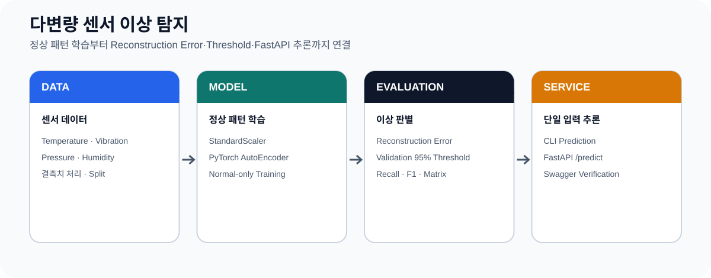

# 다변량 센서 이상 탐지

온도·진동·압력·습도 센서의 정상 패턴을 PyTorch Autoencoder로 학습하고,
Reconstruction Error를 이용해 이상 입력을 판정하는 로컬 모델
파이프라인입니다. 데이터 생성부터 전처리, 학습, 평가, CLI와 FastAPI
추론까지 동일한 Model·Scaler·Threshold Artifact로 연결합니다.



## 구현 범위

- 상관관계를 가진 정상 센서 데이터와 5종 이상 패턴 생성
- 필수 열·숫자·유한값·Binary Label 검증
- Train·Validation·Test 역할 분리와 Train-only Scaling
- 정상 Train Sample만 사용하는 PyTorch Autoencoder
- Best Validation Weight 복원과 Early Stopping
- Validation 정상 Error 95 Percentile Threshold
- Accuracy, Balanced Accuracy, Precision, Recall, F1, Specificity
- ROC AUC, Average Precision, MCC, Confusion Matrix
- 열 과부하·기계 결함·압력 이벤트·누수·복합 결함별 Recall
- Checkpoint에 Model Version·Feature 순서·Threshold·학습 설정 저장
- 단일 입력 CLI, FastAPI `/health`·`/predict`
- Feature별 Reconstruction Error
- Recall·F1 품질 게이트와 정상·이상 Smoke Test
- 독립 재학습 Pytest와 GitHub Actions

## 빠른 실행

PowerShell에서:

```powershell
cd C:\Users\kflow\Downloads\sensor-anomaly-model-pipeline
.\.venv\Scripts\python.exe -m src.pipeline
```

한 명령으로 다음 작업을 수행합니다.

```text
Synthetic Data
→ Validation / Cleaning
→ Train / Validation / Test Split
→ Train-only StandardScaler
→ Normal-only Autoencoder Training
→ Validation Threshold
→ Held-out Test Evaluation
→ CLI / API Smoke Test
→ Quality Gate
```

기본 품질 게이트는 anomaly Recall `0.85`, F1 `0.80`입니다. 기준 미달,
정상 Smoke Sample 오탐 또는 이상 Smoke Sample 미탐이 발생하면 실행을
실패 처리하고 `outputs/run_summary.json`에 원인을 기록합니다.

## 데이터와 학습

기본 실행은 Seed 42로 정상 1,500건과 이상 300건을 생성합니다.

| Class / Type | 기본 수 | 생성 방식 |
|---|---:|---|
| Normal | 1,500 | 공통 설비 부하를 반영한 센서 간 상관관계 |
| Thermal overload | 60 | 온도 급상승 |
| Mechanical fault | 60 | 진동 급상승 |
| Pressure event | 60 | 압력 급상승 또는 급하락 |
| Leak | 60 | 압력 저하와 습도 상승 |
| Combined fault | 60 | 온도·진동·압력 복합 변화 |

데이터는 실제 설비 측정값이 아니라 파이프라인 회귀검증용 합성
데이터입니다. Test Split은 정상과 각 이상 유형이 유지되도록
Stratification하며, 학습과 Threshold 결정에 Test Label을 사용하지 않습니다.

기본 모델:

```text
Input 4
→ Linear 8
→ LeakyReLU
→ Latent 2
→ Linear 8
→ LeakyReLU
→ Output 4
```

| 설정 | 기본값 |
|---|---:|
| Python | 3.11 |
| Epochs | 최대 120 |
| Batch size | 32 |
| Learning rate | 0.001 |
| Optimizer | Adam |
| Loss | Mean Squared Error |
| Early-stopping patience | 20 |
| Threshold | Validation 정상 Error 95 Percentile |
| Random seed | 42 |

## 평가

전체 파이프라인을 다시 학습하지 않고 현재 Checkpoint만 평가하려면:

```powershell
.\.venv\Scripts\python.exe -m src.evaluate --update-readme
```

평가 과정은 다음 파일을 같은 결과로 갱신합니다.

```text
outputs/evaluation_metrics.csv
outputs/evaluation_metrics.json
outputs/test_predictions.csv
outputs/confusion_matrix.png
outputs/error_distribution.png
outputs/precision_recall_curve.png
reports/evaluation_summary.json
reports/model_card.md
README.md 평가 결과 블록
```

`README.md`의 아래 블록은 수동으로 수치를 복사하지 않습니다.
`src.pipeline` 또는 `src.evaluate --update-readme`가 실제 평가 Artifact에서
자동 생성합니다.

## 검증 결과

<!-- EVALUATION_RESULTS_START -->
> 이 표는 `python -m src.pipeline` 실행 시 `reports/evaluation_summary.json`에서 자동 갱신됩니다.

| 항목 | 결과 |
|---|---:|
| Model version | `sensor-ae-669717a0dab2` |
| Test samples | 360 |
| Threshold | 0.394629 |
| Accuracy | 0.9500 |
| Balanced Accuracy | 0.9567 |
| Precision | 0.7838 |
| Recall | 0.9667 |
| F1 | 0.8657 |
| Specificity | 0.9467 |
| ROC AUC | 0.9893 |
| Average Precision | 0.9798 |
| MCC | 0.8423 |
| Confusion Matrix | TN 284 · FP 16 · FN 2 · TP 58 |

이상 유형별 탐지 결과:

| 유형 | Test 수 | 탐지 | Recall |
|---|---:|---:|---:|
| `combined_fault` | 12 | 10 | 0.8333 |
| `leak` | 12 | 12 | 1.0000 |
| `mechanical_fault` | 12 | 12 | 1.0000 |
| `pressure_event` | 12 | 12 | 1.0000 |
| `thermal_overload` | 12 | 12 | 1.0000 |
<!-- EVALUATION_RESULTS_END -->

정확한 원시 수치와 Classification Report는
[`reports/evaluation_summary.json`](reports/evaluation_summary.json), 모델
용도와 한계는 [`reports/model_card.md`](reports/model_card.md)에서 확인합니다.

## Windows 로컬 실행

프로젝트 기준 런타임은 Python 3.11입니다.

```powershell
py -3.11 -m venv .venv
.\.venv\Scripts\python.exe -m pip install --upgrade pip
.\.venv\Scripts\python.exe -m pip install -r requirements.txt
```

단계별 실행:

```powershell
.\.venv\Scripts\python.exe -m src.generate_data
.\.venv\Scripts\python.exe -m src.preprocess
.\.venv\Scripts\python.exe -m src.train
.\.venv\Scripts\python.exe -m src.evaluate --update-readme
```

학습 옵션 예:

```powershell
.\.venv\Scripts\python.exe -m src.train `
  --epochs 160 `
  --batch-size 64 `
  --lr 0.001 `
  --latent-dim 2 `
  --hidden-dim 8 `
  --threshold-percentile 95 `
  --patience 25
```

## CLI 추론

정상 입력:

```powershell
.\.venv\Scripts\python.exe -m src.predict `
  --temperature 30 `
  --vibration 0.35 `
  --pressure 100 `
  --humidity 45
```

이상 입력:

```powershell
.\.venv\Scripts\python.exe -m src.predict `
  --temperature 55 `
  --vibration 1.6 `
  --pressure 135 `
  --humidity 80
```

CLI와 API는 코드에 복사한 Threshold 상수를 사용하지 않습니다. 학습
Checkpoint의 Threshold, Feature 순서와 Model Version을 검증해 로드합니다.

## FastAPI

모델 학습 후:

```powershell
.\.venv\Scripts\python.exe -m uvicorn src.app:app `
  --host 127.0.0.1 --port 8000
```

```text
GET  /health
POST /predict
GET  /docs
```

요청:

```json
{
  "temperature": 30.0,
  "vibration": 0.35,
  "pressure": 100.0,
  "humidity": 45.0
}
```

응답 필드 계약:

```json
{
  "prediction": "normal | anomaly",
  "reconstruction_error": "<float>",
  "threshold": "<float loaded from checkpoint>",
  "error_margin": "<reconstruction_error - threshold>",
  "feature_errors": {
    "temperature": "<float>",
    "vibration": "<float>",
    "pressure": "<float>",
    "humidity": "<float>"
  },
  "model_version": "sensor-ae-<checkpoint fingerprint>",
  "input": {
    "temperature": "<float>",
    "vibration": "<float>",
    "pressure": "<float>",
    "humidity": "<float>"
  }
}
```

위 블록은 값 예시가 아니라 응답 필드 계약입니다. 실제 Model Version과
Threshold는 Checkpoint에서 로드하며, 검증된 값은 README의 자동 생성 평가
블록에 기록합니다.

## Artifact 계약

| 경로 | 내용 |
|---|---|
| `data/sensor_data.csv` | 센서 Sample, Label, 이상 유형 |
| `outputs/preprocessed_data.npz` | Train·Validation·Test와 Test 추적 정보 |
| `outputs/preprocessing_metadata.json` | 데이터 Hash, Split 수, Seed |
| `models/scaler.pkl` | Train 정상 데이터로 Fit한 StandardScaler |
| `models/autoencoder.pt` | Weight, Threshold, Feature 순서, Model Version |
| `models/model_metadata.json` | Checkpoint의 사람이 읽을 수 있는 Metadata |
| `outputs/train_history.csv` | Epoch별 Train·Validation Loss |
| `outputs/test_predictions.csv` | Sample·이상 유형별 정답, 예측, Error |
| `outputs/run_summary.json` | 전체 단계, Smoke Test, 품질 게이트 |
| `reports/evaluation_summary.json` | 저장소에 남기는 평가 결과 |
| `reports/model_card.md` | 모델 용도, 수치, 제약 |

대용량 생성 Artifact는 `.gitignore`로 제외하고, 재현 가능한 Source와 경량
평가 보고서는 저장소에 유지합니다.

## 테스트와 CI

```powershell
.\.venv\Scripts\python.exe -m pytest -q
```

테스트는 기존 Checkpoint에 의존하지 않고 임시 디렉터리에서 데이터를 만들고
별도 모델을 학습합니다.

- Autoencoder Tensor Shape와 Error 계산
- 데이터 생성·전처리·학습·평가
- 5개 이상 유형 Metadata와 유형별 평가
- Checkpoint Threshold와 추론 Threshold 일치
- README 평가 블록 자동 갱신
- 정상·이상 CLI Predictor
- FastAPI Health, Prediction, 입력 Validation

GitHub Actions는 Python 3.11에서 테스트와 축소형 End-to-End Pipeline을
실행합니다.

## 프로젝트 구조

```text
sensor-anomaly-model-pipeline/
├─ .github/workflows/ci.yml
├─ docs/assets/
├─ reports/
│  ├─ evaluation_summary.json
│  └─ model_card.md
├─ scripts/run_pipeline.ps1
├─ src/
│  ├─ artifacts.py
│  ├─ config.py
│  ├─ generate_data.py
│  ├─ preprocess.py
│  ├─ model.py
│  ├─ train.py
│  ├─ evaluate.py
│  ├─ predict.py
│  ├─ app.py
│  └─ pipeline.py
├─ tests/
├─ pyproject.toml
├─ requirements.txt
└─ README.md
```

## 한계

- 실제 제조 설비가 아닌 합성 데이터 평가입니다.
- 한 행의 다변량 입력을 사용하며 시간 Window와 장기 추세를 학습하지 않습니다.
- 이상 판정은 고장 원인 진단이 아니라 점검 우선순위를 위한 신호입니다.
- 설비, 센서, 운전 모드가 바뀌면 Scaler와 Threshold를 재학습해야 합니다.
- 운영 적용 전 실제 데이터 Label, 오탐·미탐 비용과 Drift 기준이 필요합니다.
- Pickle과 PyTorch Checkpoint는 신뢰할 수 있는 저장소에서만 로드해야 합니다.
