# 다변량 센서 이상 탐지

> **온도·진동·압력·습도 센서 데이터를 전처리하고, 정상 데이터 기반 PyTorch AutoEncoder를 학습해 Reconstruction Error로 이상 여부를 판단한 모델 파이프라인**

<p>
  
  
  
  
</p>

<p align="center">
  
</p>

**저장소 ID:** `sensor-anomaly-model-pipeline`

[GitHub Profile](https://github.com/lightleaping) · [모델 접근](#5-모델-접근) · [평가](#6-평가) · [실행 방법](#9-실행-방법)

---

## 채용담당자 요약

| 구분 | 내용 |
|---|---|
| 형태 | 개인 프로젝트 · 1인 모델 파이프라인 구현 |
| 분야 | Sensor Data · Anomaly Detection · PyTorch · FastAPI |
| 문제 | 정상 센서 패턴과 다른 입력을 하나의 정량적 이상 점수로 판별할 필요 |
| 입력 | Temperature · Vibration · Pressure · Humidity |
| 모델 | 정상 데이터 기반 PyTorch AutoEncoder |
| 판별 | Reconstruction Error와 Validation 95 Percentile Threshold 비교 |
| 평가 | Accuracy·Precision·Recall·F1·Confusion Matrix |
| 서비스 | CLI 단일 입력 추론·FastAPI `/predict`·Swagger UI |
| 내 역할 | 데이터 생성·전처리·Split·모델·평가·CLI·API·문서화 전반 |

---

## 문제 → 수행 → 평가

| 문제와 필요성 | 수행 | 평가·검증 |
|---|---|---|
| 이상 데이터가 충분하지 않거나 유형이 다양할 수 있어 모든 이상 패턴을 지도학습하기 어려움 | 정상 데이터만 사용해 AutoEncoder가 정상 패턴을 복원하도록 학습 | Reconstruction Error 분포와 Threshold |
| 센서 Scale이 다르면 특정 Feature가 Loss를 지배할 수 있음 | `StandardScaler`로 학습·추론 입력을 동일하게 정규화 | Scaler Artifact 재사용·CLI/API 입력 검증 |
| Accuracy만 보면 소수 이상 Class를 놓칠 수 있음 | Precision·Recall·F1·Confusion Matrix를 함께 확인 | 샘플 테스트 anomaly Recall **1.0**, 정상 오탐 Trade-off 설명 |
| 모델 파일만 있으면 실제 입력 흐름을 검증하기 어려움 | CLI Prediction과 FastAPI `/predict` 구현 | Swagger UI·로컬 API 응답 확인 |

---

## 1. 프로젝트 필요성

제조 설비의 센서 입력은 온도·진동·압력·습도처럼 여러 Feature로 구성됩니다. 실제 이상 데이터가 충분하지 않거나 새로운 이상 유형이 발생할 수 있으므로, 정상 상태의 패턴을 먼저 학습한 뒤 정상과 다른 입력을 탐지하는 접근을 적용했습니다.

이 프로젝트의 목표는 단순히 AutoEncoder 모델을 작성하는 것이 아니라 다음 전체 흐름을 연결하는 것입니다.

```text
데이터 생성
→ 결측치 처리
→ Feature / Label 분리
→ Train / Validation / Test Split
→ StandardScaler
→ Normal-only AutoEncoder Training
→ Reconstruction Error
→ Validation Threshold
→ Test Evaluation
→ CLI / FastAPI Inference
```

---

## 2. 일정·범위·내 역할

### 구현 범위
- 온도·진동·압력·습도 센서 샘플 데이터 생성
- 결측치 처리
- Feature와 Label 분리
- Train·Validation·Test Split
- `StandardScaler` 정규화
- 정상 데이터만 사용한 PyTorch AutoEncoder 학습
- Reconstruction Error 계산
- Validation Error 95 Percentile Threshold 설정
- Accuracy·Precision·Recall·F1·Confusion Matrix 평가
- 단일 샘플 CLI 추론
- FastAPI `/predict` Endpoint
- Swagger UI 응답 확인
- 실행 방법과 한계 문서화

### 내 역할
- 센서 Feature 설계
- 샘플 데이터 생성 코드 구현
- 데이터 전처리 파이프라인 구성
- AutoEncoder 모델·학습·평가 코드 구현
- Model·Scaler·Threshold Artifact 연결
- CLI와 FastAPI 추론 구현
- 평가 결과 해석·README 작성

---

## 3. 시스템 구조

```mermaid
flowchart LR
    RAW[Sensor CSV] --> CLEAN[Missing Value Handling]
    CLEAN --> SPLIT[Train / Val / Test]
    SPLIT --> NORMAL[Normal-only Train Data]
    NORMAL --> SCALE[StandardScaler]
    SCALE --> AE[PyTorch AutoEncoder]
    AE --> VAL[Validation Reconstruction Error]
    VAL --> TH[95 Percentile Threshold]
    TH --> TEST[Test Error & Classification]
    TEST --> METRIC[Accuracy · Precision · Recall · F1 · Matrix]

    INPUT[Single Sensor Input] --> API[CLI / FastAPI /predict]
    API --> LOAD[Load Scaler · Model · Threshold]
    LOAD --> ERROR[Reconstruction Error]
    ERROR --> DECISION[Normal / Anomaly]

    classDef data fill:#ECFDF5,stroke:#0F766E,color:#0F172A;
    classDef model fill:#EFF6FF,stroke:#2563EB,color:#0F172A;
    classDef eval fill:#FFF7ED,stroke:#D97706,color:#0F172A;
    classDef service fill:#F8FAFC,stroke:#334155,color:#0F172A;
    class RAW,CLEAN,SPLIT,NORMAL,SCALE data;
    class AE,LOAD,ERROR model;
    class VAL,TH,TEST,METRIC,DECISION eval;
    class INPUT,API service;
```



---

## 4. 데이터 파이프라인

### 입력 Feature
| Feature | 의미 |
|---|---|
| `temperature` | 설비 온도 상태 |
| `vibration` | 진동 상태 |
| `pressure` | 압력 상태 |
| `humidity` | 습도 상태 |

### 전처리 원칙
1. CSV 데이터 로드
2. 결측치 처리
3. Feature와 Label 분리
4. Train·Validation·Test 분리
5. Train 기준 `StandardScaler` 학습
6. Validation·Test·Inference에 같은 Scaler 적용
7. 학습에는 정상 Sample만 사용

학습과 추론에서 서로 다른 정규화 기준을 사용하면 Reconstruction Error 비교가 왜곡될 수 있으므로, 저장된 Scaler를 추론에서도 재사용합니다.

---

## 5. 모델 접근

AutoEncoder는 입력을 낮은 차원의 표현으로 압축한 뒤 원래 입력을 복원합니다.

- 정상 데이터와 유사한 입력: 복원이 비교적 잘 되어 Error가 작을 가능성
- 정상 패턴과 다른 입력: 복원이 어려워 Error가 커질 가능성

```text
reconstruction_error > threshold  → anomaly
reconstruction_error <= threshold → normal
```

### Threshold 정책
Validation 정상 데이터의 Reconstruction Error 분포에서 **95 Percentile**을 Threshold로 사용했습니다.

이 정책은 고정된 절대값을 임의로 정하는 대신 현재 학습 데이터의 Error 분포를 반영합니다. 다만 실제 운영 환경에서는 데이터 Drift와 오탐·미탐 비용을 고려해 재조정해야 합니다.

---

## 6. 평가

평가 지표:
- Accuracy
- Precision
- Recall
- F1 Score
- Confusion Matrix

이상 탐지에서는 이상 Sample을 놓치지 않는 것이 중요하므로 Recall을 특히 확인했습니다.

### 포트폴리오 기준 결과 해석
- 샘플 Test 데이터에서 anomaly Recall **1.0** 확인
- 일부 정상 Sample을 이상으로 판정한 사례 존재
- 이상을 놓치지 않는 방향의 Threshold 결과지만, 운영 적용 전 False Positive 비용을 함께 검토해야 함

정확한 전체 수치 Artifact가 확인되지 않는 지표는 임의로 추가하지 않습니다.

---

## 7. 추론 API

### Endpoint
| Method | Endpoint | 역할 |
|---|---|---|
| `POST` | `/predict` | 센서 입력을 정규화하고 Reconstruction Error와 이상 여부 반환 |

### Request
```json
{
  "temperature": 25,
  "vibration": 0.3,
  "pressure": 101,
  "humidity": 45
}
```

### Response 구조
```json
{
  "prediction": "normal",
  "reconstruction_error": 0.0,
  "threshold": 0.0
}
```

위 값은 구조 예시이며 실제 값은 저장된 Model과 Threshold에 따라 달라집니다.

---

## 8. 프로젝트 구조

```text
sensor-anomaly-model-pipeline/
├─ src/
│  ├─ generate_data.py   # 센서 샘플 데이터 생성
│  ├─ preprocess.py      # 결측치·Split·Scaling
│  ├─ model.py           # PyTorch AutoEncoder
│  ├─ train.py           # 정상 데이터 학습
│  ├─ evaluate.py        # Error·Threshold·지표 평가
│  ├─ predict.py         # 단일 샘플 CLI 추론
│  └─ app.py             # FastAPI /predict
├─ data/                 # 생성·전처리 데이터
├─ models/               # Model·Scaler·Threshold
├─ outputs/              # 평가 결과·Confusion Matrix
├─ docs/
│  ├─ assets/
│  └─ archive/
├─ requirements.txt
└─ README.md
```

---

## 9. 실행 방법

### 1) 가상환경
```powershell
python -m venv .venv
.\.venv\Scripts\Activate.ps1
python -m pip install --upgrade pip
pip install -r requirements.txt
```

### 2) 데이터 생성
```powershell
python src/generate_data.py
```

### 3) 전처리
```powershell
python src/preprocess.py
```

### 4) 모델 학습
```powershell
python src/train.py
```

### 5) 평가
```powershell
python src/evaluate.py
```

### 6) CLI 추론
```powershell
python src/predict.py --temperature 25 --vibration 0.3 --pressure 101 --humidity 45
python src/predict.py --temperature 80 --vibration 5.0 --pressure 180 --humidity 90
```

### 7) FastAPI
```powershell
uvicorn src.app:app --reload
```

Swagger UI:
```text
http://127.0.0.1:8000/docs
```

---

## 10. 실행 확인 범위

로컬 Windows PowerShell 환경에서 다음 항목을 확인했습니다.

1. 원격 저장소와 로컬 코드 동기화
2. Python 가상환경 활성화
3. `requirements.txt` 패키지 설치
4. `src` 파일 구조
5. CLI 필수 인자
6. FastAPI 서버 실행
7. Swagger UI `/predict` 응답

자동화된 전체 회귀 테스트 수가 확인되지 않으므로, 다른 프로젝트의 테스트 수치를 이 프로젝트에 적용하지 않습니다.

---

## 11. 설계 판단

### 정상 데이터 기반 학습
이상 유형을 모두 수집하기 어렵다는 문제를 고려해 정상 패턴 학습 방식을 사용했습니다.

### Validation 기준 Threshold
Test 데이터에 맞춰 Threshold를 조정하지 않고 Validation Error 분포에서 결정하도록 분리했습니다.

### 평가 지표 다중 확인
Accuracy만 제시하지 않고 Precision·Recall·F1·Confusion Matrix를 함께 확인했습니다.

### Model Artifact와 API 연결
학습한 모델뿐 아니라 Scaler와 Threshold도 함께 로드해 동일한 전처리·판별 기준을 유지했습니다.

---

## 12. 한계와 개선 방향

### 현재 한계
- 실제 설비가 아닌 샘플 센서 데이터 중심
- Threshold가 현재 Dataset Error 분포에 의존
- 다양한 AutoEncoder 구조 비교 부족
- 데이터 Drift·운영 Monitoring 미구현
- API 요청 로그와 Model Version 관리 부족
- Sequence Window를 사용하는 시계열 모델이 아님

### 개선 방향
1. 실제 센서 Dataset 적용
2. Window 기반 시계열 Feature 구성
3. LSTM AutoEncoder·1D CNN·Isolation Forest 비교
4. Precision-Recall Curve 기반 운영 Threshold 선택
5. Feature별 Error 기여도 분석
6. Model Registry·Version·Request Log
7. Docker·CI·Monitoring Dashboard
8. 데이터 Drift 탐지와 Threshold 재보정

---

## 13. 이 프로젝트가 보여주는 역량

- 다변량 센서 데이터 전처리
- 정상 데이터 기반 비지도·준지도 이상 탐지 접근
- PyTorch AutoEncoder 학습과 Reconstruction Error 해석
- Validation Threshold와 평가 데이터 역할 분리
- Recall 중심 이상 탐지 평가
- Model·Scaler·Threshold Artifact 추론 연결
- CLI와 FastAPI를 통한 모델 서비스화
- 구현 범위와 한계를 과장하지 않는 문서화

---

## 연락처

- Developer: 김수진
- GitHub: [github.com/lightleaping](https://github.com/lightleaping)
- Email: workingskyroad@gmail.com

<details>
<summary>개편 전 상세 README 보존</summary>

적용 스크립트는 기존 README를 `docs/archive/README_before_encell.md`에 백업합니다.

</details>
